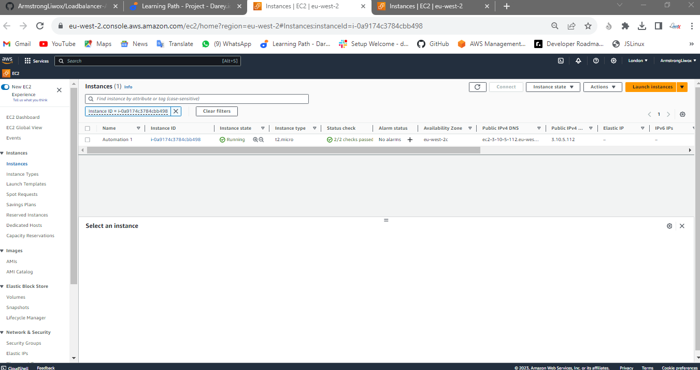

# Loadbalancer-Automation - ***Armstrong***

## Automating LoadBalancer configuration with Shell Scripting

> This course is an introduction to automation

>This projects demonstrates how to automate the setup and maintenance of loadbalancer using a freestyle job, enhancing efficiency and and reducing manual effort.

---

## Automate the deployment of webservers

## Deploying and configuring webservers

## Step 1: 

> Provision an EC2 instance



> Open port 8000 to allow traffic


> Connect to the server uisng ssh


> Open a script file and paste code

```
sudo vi install.sh
```

```
#!/bin/bash

####################################################################################################################
##### This automates the installation and configuring of apache webserver to listen on port 8000
##### Usage: Call the script and pass in the Public_IP of your EC2 instance as the first argument as shown below:
######## ./install_configure_apache.sh 127.0.0.1
####################################################################################################################

set -x # debug mode
set -e # exit the script if there is an error
set -o pipefail # exit the script when there is a pipe failure

PUBLIC_IP=$1

[ -z "${PUBLIC_IP}" ] && echo "Please pass the public IP of your EC2 instance as an argument to the script" && exit 1

sudo apt update -y &&  sudo apt install apache2 -y

sudo systemctl status apache2

if [[ $? -eq 0 ]]; then
    sudo chmod 777 /etc/apache2/ports.conf
    echo "Listen 8000" >> /etc/apache2/ports.conf
    sudo chmod 777 -R /etc/apache2/

    sudo sed -i 's/<VirtualHost \*:80>/<VirtualHost *:8000>/' /etc/apache2/sites-available/000-default.conf

fi
sudo chmod 777 -R /var/www/
echo "<!DOCTYPE html>
        <html>
        <head>
            <title>My EC2 Instance</title>
        </head>
        <body>
            <h1>Welcome to my EC2 instance</h1>
            <p>Public IP: "${PUBLIC_IP}"</p>
        </body>
        </html>" > /var/www/html/index.html

sudo systemctl restart apache2
```


> Change permmision on the file to make it executable

```
sudo chmod +x install.sh
```

> Run the shell script

```
./install.sh PUBLIC_IP
```


